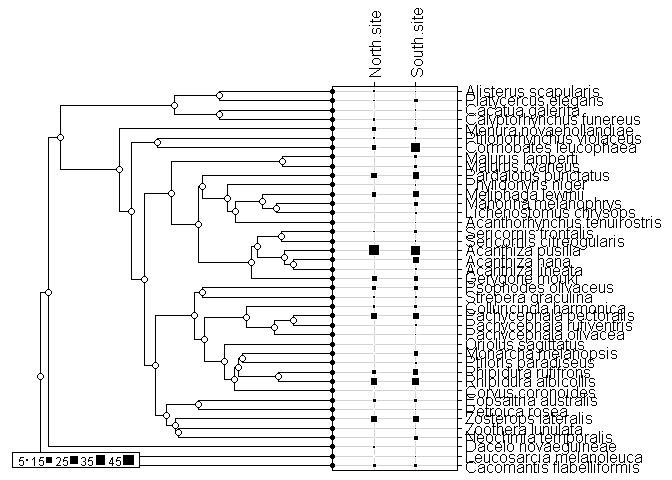
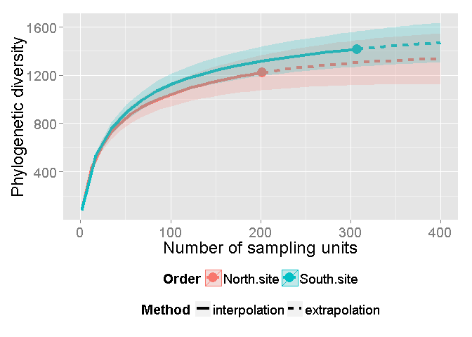
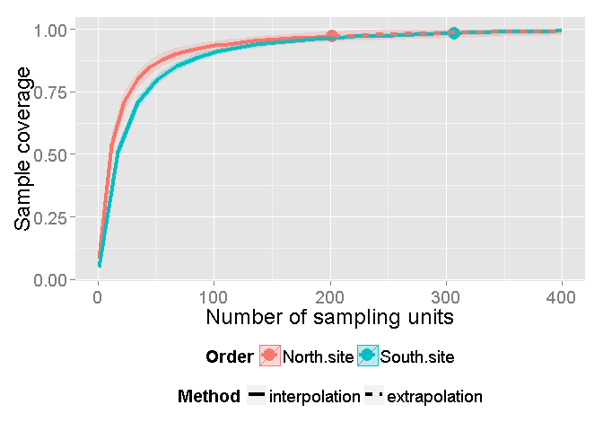
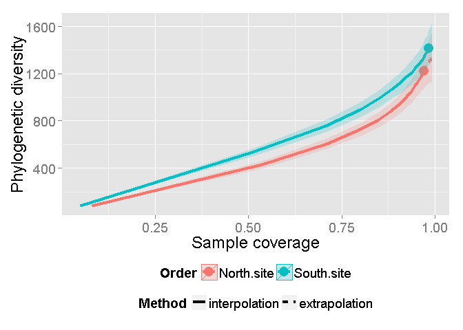

iNextPD (R package)
===================

<h4>
Most recent update time: June 16, 2015
</h4>
<h4>
by T. C. Hsieh, Chun-Huo Chiu, and Anne Chao
</h4>
<h4>
Institute of Statistics, National Tsing Hua University, Hsin-Chu, Taiwan
30043
</h4>
The program iNextPD is a R source code to compute the Rarefaction and
extrapolation of phylogenetic diversity (PD) present by Chao et al.
(2014). This program provieds the interpolated and extrapolted value of
Faith's PD (the total branch length of a phylogenetic tree). Three types
of curve are allowed:

1.  Sample-size-based rarefaction and extrapolation (R/E) of PD.
2.  R/E of sample coverage.
3.  Coverage-based R/E of PD.

### Software needed to run the development version

-   Required: [R](http://cran.rstudio.com/)
-   Suggested: [RStudio IDE](http://www.rstudio.com/ide/download/)

### How to run: start R(studio) and copy-and-paste the following commands:

Start R(studio) and copy-and-paste the commands below:

    # install packages, you can skip this commands if you had installed them
    install.packages(c("devtools","ade4","ggplot2"))
    library(devtools)
    install_github('JohnsonHsieh/iNextPD')
    library(iNextPD)

Run a simple example:

-   Read the birds data in New South Wales into R

<!-- -->

    # sample species frequencies for two sites
    data(bird)
    abun <- bird$abun
    labels <- rownames(abun)
    phy <- newick2phylog(bird$tre)
    table.phylog(abun, phy, csize=4, f.phylog=0.7)

-   Compute the interpolation and extrapolation of PD

<!-- -->

    out <- iNextPD(abun=abun, labels=labels, phy=phy, endpoint=400, se=TRUE)
    ggiNEXT(out, type=1, color.var="site") # Sample-size-based R/E of PD

    ggiNEXT(out, type=2, color.var="site") # R/E of sample coverage

    ggiNEXT(out, type=3, color.var="site") # Coverage-based R/E of PD

